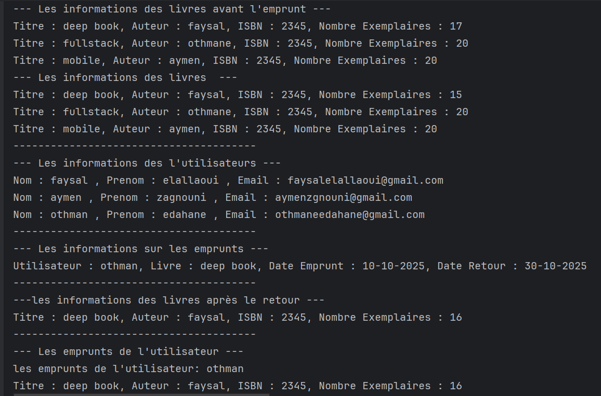

# 📚 Gestion de Bibliothèque en Kotlin

## 🧾 Description
Ce projet est une **application de gestion de bibliothèque** développée en **Kotlin**, basée sur les **concepts de la programmation orientée objet (POO)**.  
Le système permet de gérer :
- Les **livres**
- Les **utilisateurs**
- Les **emprunts de livres**
- Et d’organiser le tout à travers une **classe Bibliothèque**.

L’objectif est de simuler les opérations de base d’une bibliothèque : emprunter, retourner, rechercher et afficher les livres disponibles.

---

## 🧱 Structure du Projet

### 1. Classe `Personne`
Représente une personne générique.

**Attributs :**
- `nom`
- `pernom`
- `email`

**Méthode :**
- `afficherInfos()` → Affiche les informations de la personne.

---

### 2. Classe `Utilisateur` (hérite de `Personne`)
Représente un utilisateur de la bibliothèque.

**Attributs :**
- `idUtilisateur`
- `emprunts` : liste des livres empruntés

**Méthodes :**
- `emprunterLivre(livre, dateEmprunt)` → Permet à l’utilisateur d’emprunter un livre si disponible.  
- `afficherEmprunts()` → Affiche tous les livres empruntés par l’utilisateur.

---

### 3. Classe `Livre`
Représente un livre disponible dans la bibliothèque.

**Attributs :**
- `titre`
- `auteur`
- `isbn`
- `nombreExemplaires`

**Méthodes :**
- `afficherDetails()` → Affiche les informations du livre.  
- `disponiblePourEmprunt()` → Vérifie s’il reste des exemplaires disponibles.  
- `mettreAJourStock(nouveauStock)` → Met à jour le nombre d’exemplaires.

---

### 4. Classe `Emprunt`
Représente une opération d’emprunt d’un livre par un utilisateur.

**Attributs :**
- `utilisateur`
- `livre`
- `dateEmprunt`
- `dateRetour` *(optionnel)*

**Méthodes :**
- `afficherDetails()` → Affiche les détails de l’emprunt.  
- `retournerLivre(date)` → Met à jour la date de retour et rétablit le stock du livre.  
- `ajouterEmprunt(liste)` → Ajoute l’emprunt à une liste d’emprunts et diminue le stock.

---

### 5. Classe Abstraite `GestionBibliotheque`
Définit les méthodes générales de gestion d’une bibliothèque.

**Attributs :**
- `utilisateurs : MutableList<Utilisateur>`
- `livres : MutableList<Livre>`

**Méthodes abstraites :**
- `ajouterUtilisateur(utilisateur)`
- `ajouterLivre(livre)`
- `afficherTousLesLivres()`

---

### 6. Classe `Bibliotheque` (hérite de `GestionBibliotheque`)
Implémente les méthodes abstraites et ajoute une fonction de recherche.

**Méthodes :**
- `ajouterUtilisateur(utilisateur)`  
- `ajouterLivre(livre)`  
- `afficherTousLesLivres()`  
- `rechercherLivreParTitre(titre)` → Recherche un livre dans la liste selon son titre.

---

## ⚙️ Fonctionnement dans `main()`

1. Création d’une instance de `Bibliotheque`.  
2. Ajout de plusieurs livres (`Livre`) et utilisateurs (`Utilisateur`).  
3. Création de quelques emprunts (`Emprunt`).  
4. Ajout des emprunts à la liste.  
5. Simulation d’emprunt et de retour de livre.  
6. Affichage des livres, des utilisateurs et des emprunts.

---

## 🧠 Exemple de Sortie Console
# 📸 Screenshots
